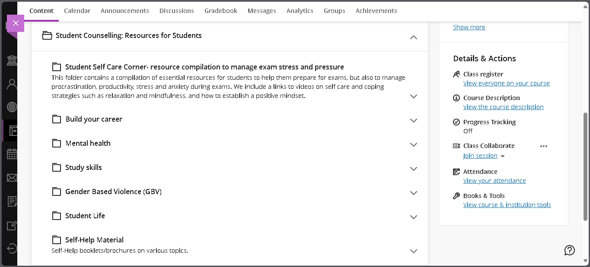
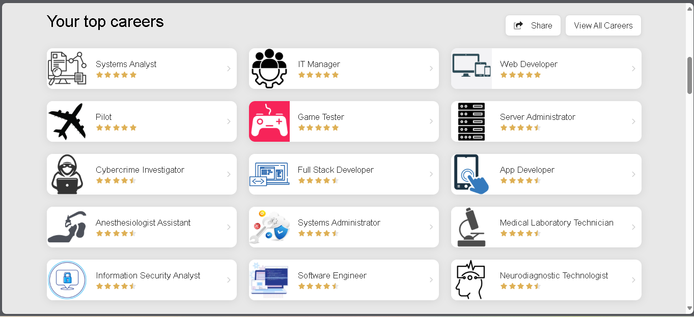
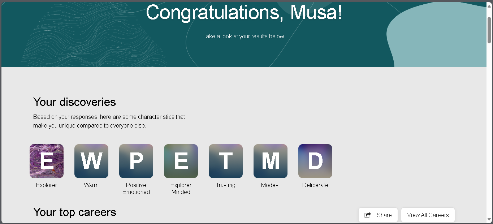
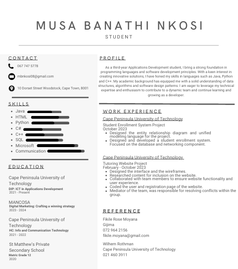
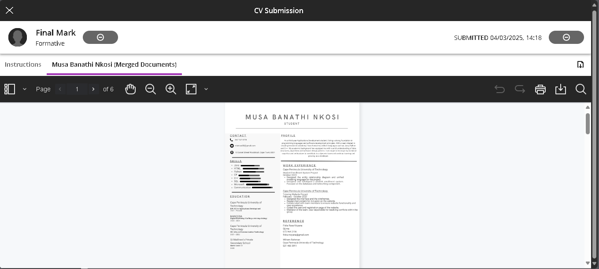

# Digital-Portfolio
**Student Name:** Musa Banathi Nkosi  
**Student Number:** 221744517  
**Course Code:** PRP372S  
**Qualification:** Diploma in ICT: Applications Development  
**Institution:** Cape Peninsula University of Technology

## (1) Career Counselling 

### Evidence  
I am currently enrolled in the Student Counselling for Students course on Blackboard. This  section includes self-help resources on topics such as career building, mental health, and study skills.  

  

### STAR Reflection

- **Situation:** As part of my work readiness training, I accessed the Student Counselling resources on Blackboard.  
- **Task:** I needed to explore support available to improve my career readiness and manage study stress.  
- **Action:** I reviewed topics such as "Build your career," "Mental health," and "Study skills" to develop a balanced approach.  
- **Result:** I gained valuable strategies to improve productivity, mental wellness, and career preparation.  

## (2) Skills and Interests

### Evidence  
I completed a self-assessment quiz on career skills and interests, which identified my strengths in communication, problem-solving, and teamwork.  
  

### STAR Reflection

- **Situation:** To better understand my strengths, I completed a skills and interests assessment so I have a better understanding in knowing what I like and do not like.  
- **Task:** The task was to identify skills that align with my career goals, and suggest other careers I might find interest in.  
- **Action:** I carefully answered the assessment questions and analyzed my results.  
- **Result:** The results helped me recognize my key skills and areas to improve, guiding my career planning.

## (3) Personality Assessment

### Evidence
I completed a personality assessment from __https://www.careerexplorer.com/__, which indicated I am an **INFJ** — a reflective, empathetic, and organized individual.

### STAR Reflection

- **Situation:** As part of career readiness, I took the personality test.  
- **Task:** I needed to understand how my personality influences my work style and career fit.  
- **Action:** I completed the personality assessment online and reviewed the report thoroughly.  
- **Result:** Understanding my INFJ personality type helped me appreciate my strengths in empathy and planning, aiding my career decisions.

## (4) CV

### Evidence
I created a professional CV using Canva, highlighting my education, skills, work experience, and achievements.

# Musa Banathi Nkosi – Curriculum Vitae

## 📍 Contact

- **Phone:** 067 747 5778  
- **Email:** mbnkosi08@gmail.com  
- **Address:** 10 Dorset Street, Woodstock, Cape Town, 8001  
- **GitHub (optional):** https://github.com/MusaNkosi08

## 👨‍💻 Professional Summary

Motivated and detail-oriented third-year ICT student specializing in Applications Development. Skilled in Java, Python, and SQL with a solid foundation in data structures, algorithms, and database design. Proven ability to work collaboratively in group projects and independently on technical tasks. Passionate about developing user-focused solutions and committed to continuous growth in the software development industry.

## 💻 Technical Skills

**Languages:** Java, Python, HTML, C#, C++, SQL  
**Tools:** Microsoft Office, VS Code, MySQL Workbench  
**Soft Skills:** Communication, Collaboration, Problem Solving

## 🎓 Education

**Cape Peninsula University of Technology**  
Diploma in ICT – Applications Development  
_2021 – Present_

**Cape Peninsula University of Technology**  
Higher Certificate in ICT  
_2021 – 2022_

**St Matthew’s Private Secondary School**  
Matric (Grade 12)  
_2020_

## 🧪 Projects & Experience

### 🎯 Student Enrollment System  
**Role:** Database & Systems Designer  
📅 October 2023  
- Designed ERD and UML diagrams for a fully functional student enrollment system.  
- Focused on backend logic, database integration, and network interaction.  
- Applied principles of system design and user data validation.

### 🧑‍🏫 Tutoring Website  
**Role:** Front-End Developer & Team Mediator  
📅 February – October 2023  
- Designed wireframes and UI layout for a tutoring platform.  
- Researched content and structured website navigation.  
- Developed user registration and login pages.  
- Facilitated communication and resolved conflicts among team members.

## 📜 Certifications

**MANCOSA** – *Digital Marketing: Crafting a Winning Strategy*  
2023 – 2024

## 📞 References

**Fikile Rose Moyana**  
Gijima  
📞 072 964 2156  
✉️ fikile.moyana@gmail.com

**Wilhem Rothman**  
Cape Peninsula University of Technology  
📞 021 460 3911

### STAR Reflection

- **Situation:** To apply for jobs confidently, I needed a well-structured CV.  
- **Task:** The task was to create a CV that clearly showcases my qualifications and experience.  
- **Action:** I followed guidelines for CV writing, including clear sections and keywords. My lecturer posted LinkedIn Learning links of videos that will help guide in curating a good CV that will be seen by potential employers.   
- **Result:** The completed CV is ready for job applications.

## (5) CV Submission

### Evidence
I submitted my final CV as part of a previous assignment via Blackboard. I submitted my finalized CV through multiple channels, including a previous GitHub assignment and directly to several hiring companies in Cape Town as part of my work readiness development. The CV was also shared with university career support staff for feedback and potential placement opportunities.

  

### STAR Reflection

- **Situation:** As part of the Work Readiness programme and a previous academic assignment, I was required to create and submit a professional CV.
- **Task:** My goal was to compile a CV that reflected my education, technical skills, and project experience, then submit it via GitHub and to real employers for exposure to the job market.
- **Action:** I created a polished CV, submitted it through GitHub for assessment, and proactively applied to several Cape Town-based companies. I also shared it with CPUT career services for potential opportunities and feedback.
- **Result:** I received confirmation of submission from all platforms, and the feedback from peers and staff helped me refine the CV further. This increased my confidence and readiness to apply for internships and junior roles in the ICT industry.  
---